# Chapter 10 - Design Patterns Masterclass 

## How To Study This Chapter

For each pattern:

1. Problem Statement
2. Mermaid Diagram
3. Java Example
4. Sequence Flow
5. Real World Usage
6. Interview Notes

---

# Builder Pattern

## Problem

Too many constructor parameters.

```java
User user = new User("Tinh","Ly","Van","VN","Bac Ninh");
```

## Diagram

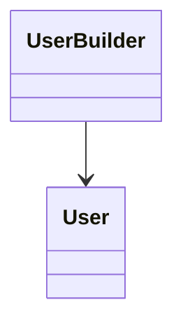

## Code

```java
User user = User.builder()
    .firstName("Tinh")
    .lastName("Ly")
    .build();
```

## Real Project

- DTO creation
- Configuration objects
- Spring builders

---

# Factory Method Pattern

## Problem

Create objects without exposing creation logic.

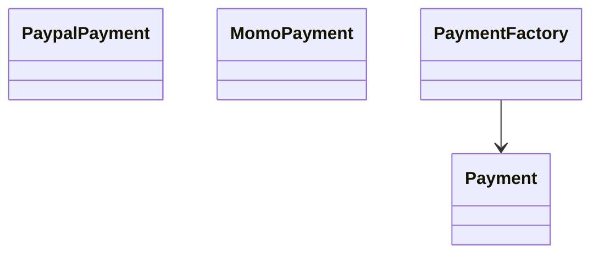

```java
Payment payment = factory.create("PAYPAL");
```

## Usage

- Spring BeanFactory
- JDBC Drivers

---

# Singleton Pattern

## Problem

Need exactly one instance.

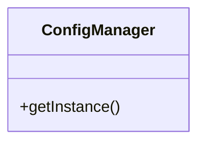

```java
public enum ConfigManager {
 INSTANCE;
}
```

## Usage

- Logger
- Cache Manager

---

# Adapter Pattern

## Problem

Integrate incompatible APIs.

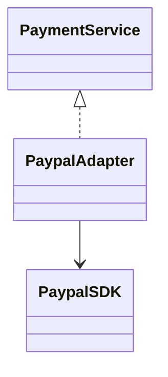

```java
adapter.pay();
```

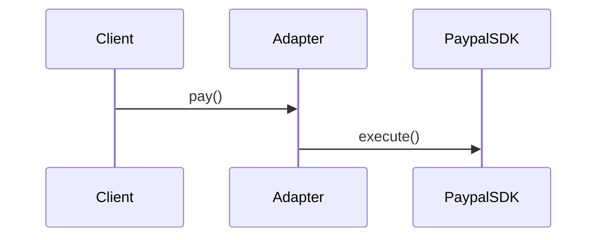

## Usage

- Legacy integration
- SAP integration

---

# Facade Pattern

## Problem

Hide complex subsystem.

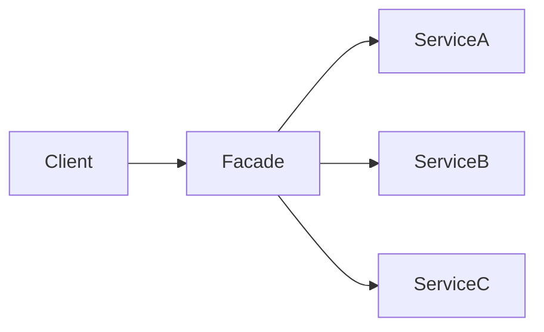

```java
orderFacade.placeOrder();
```

---

# Proxy Pattern

## Problem

Add control before accessing target.

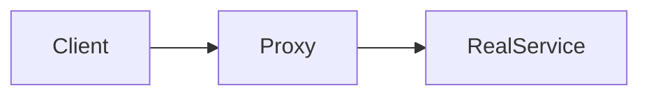

Examples:

- Spring AOP
- JDK Dynamic Proxy

---

# Decorator Pattern

## Problem

Add behavior dynamically.

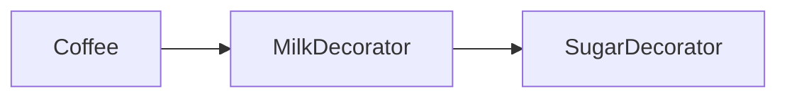

```java
coffee = new SugarDecorator(
           new MilkDecorator(coffee));
```

---

# Strategy Pattern

## Problem

Switch algorithms at runtime.

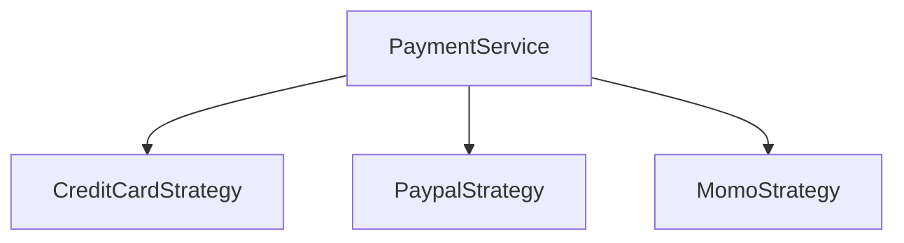

```java
strategy.pay();
```

## Usage

- Payment methods
- Sorting algorithms

---

# Observer Pattern

## Problem

Notify multiple services when event occurs.

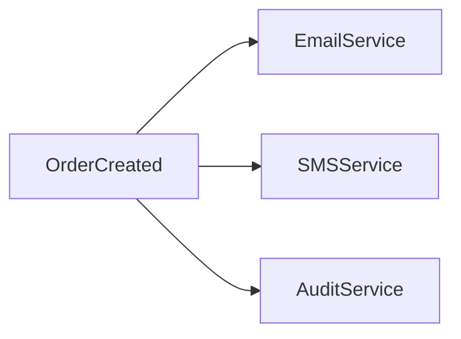

## Usage

- Event Driven Architecture
- Spring Events

---

# Command Pattern

## Problem

Encapsulate request as object.

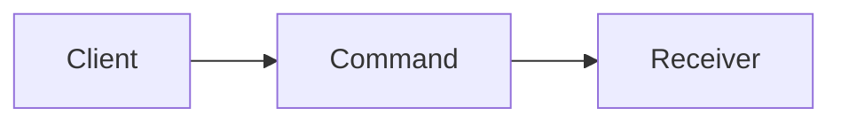

Example:

```java
command.execute();
```

---

# Template Method Pattern

## Problem

Reuse common workflow.

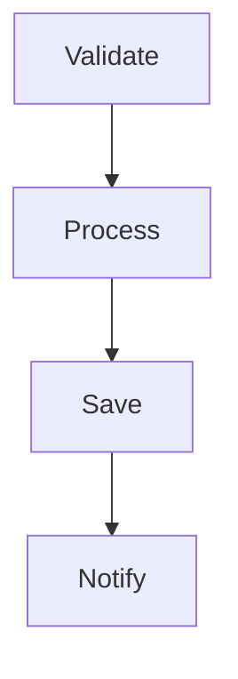

Subclass customizes steps.

---

# Chain of Responsibility

## Problem

Pass request through handlers.

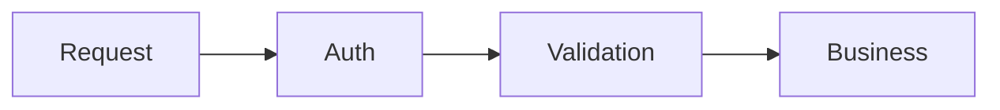

Usage:

- Spring Security Filter Chain

---

# State Pattern

## Problem

Behavior changes based on current state.

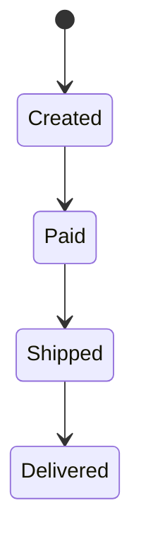

Examples:

- Order lifecycle

---

# Pattern Selection Guide

| Scenario | Pattern |
|-----------|----------|
| Complex Object Creation | Builder |
| Runtime Algorithm | Strategy |
| Event Notification | Observer |
| Legacy Integration | Adapter |
| Simplified API | Facade |
| Access Control | Proxy |
| Workflow Reuse | Template Method |
| Request Pipeline | Chain of Responsibility |

---

# Senior Java Interview Questions

1. Strategy vs State?
2. Adapter vs Facade?
3. Proxy vs Decorator?
4. Why Builder over Constructor?
5. Where does Spring use Factory?
6. Where does Spring use Proxy?
7. Observer vs Event Driven?
8. Explain Filter Chain pattern.

---

# Architect Checklist

✅ Singleton
✅ Factory
✅ Builder
✅ Adapter
✅ Facade
✅ Proxy
✅ Decorator
✅ Strategy
✅ Observer
✅ Command
✅ Template Method
✅ State
✅ Chain of Responsibility
