# Chapter 39 - API & Integration Architecture Enterprise Edition

## Learning Objectives

- Design enterprise-scale APIs
- Master REST, GraphQL, gRPC and Event-Driven APIs
- Build API Gateway, BFF and Service Mesh architectures
- Implement OAuth2, OIDC, JWT and mTLS
- Govern hundreds of APIs across organizations
- Design multi-region, highly available API platforms

---

# Part I. API Architecture Evolution

## Monolith → SOA → Microservices

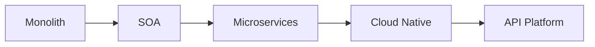

Key lessons:
- Reduce coupling
- Improve scalability
- Enable independent deployment

---

# Part II. API First Architecture

Principles:

1. Design contract before code
2. APIs are products
3. Developers are customers
4. Backward compatibility matters

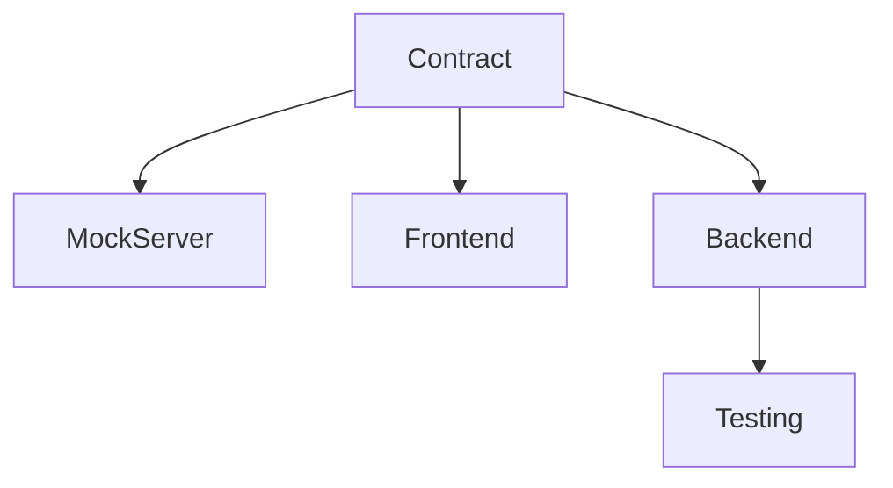

---

# Part III. Richardson Maturity Model

## Level 0 - RPC
```http
POST /createOrder
```

## Level 1 - Resources
```http
/orders
```

## Level 2 - HTTP Verbs
```http
GET /orders
POST /orders
```

## Level 3 - HATEOAS
Hypermedia-driven APIs.

---

# Part IV. REST API Design Masterclass

## Resource Naming

Good:

```text
/orders
/customers
/products
```

Bad:

```text
/getOrders
/createProduct
```

## Pagination

```http
GET /orders?page=1&size=20
```

## Filtering

```http
GET /orders?status=PAID
```

## Sorting

```http
GET /orders?sort=createdAt,desc
```

---

# Part V. Idempotency and Reliability

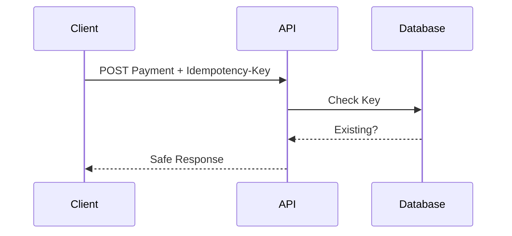

Use cases:
- Payments
- Orders
- External integrations

---

# Part VI. API Versioning

Strategies:

- URI Versioning
- Header Versioning
- Media-Type Versioning

Recommendation:

- Public APIs → URI
- Internal APIs → Header

---

# Part VII. GraphQL Deep Dive

Architecture:

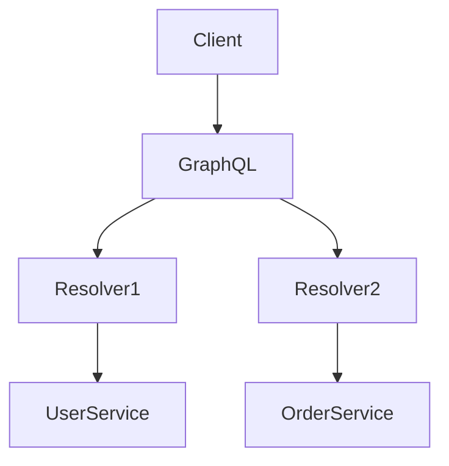

Topics:
- Schema Design
- Federation
- DataLoader
- Query Complexity Analysis
- N+1 Problem

---

# Part VIII. gRPC Deep Dive

```proto
service OrderService {
  rpc GetOrder(OrderRequest)
      returns (OrderResponse);
}
```

Communication Types:

- Unary
- Client Streaming
- Server Streaming
- Bidirectional Streaming

---

# Part IX. Event-Driven APIs

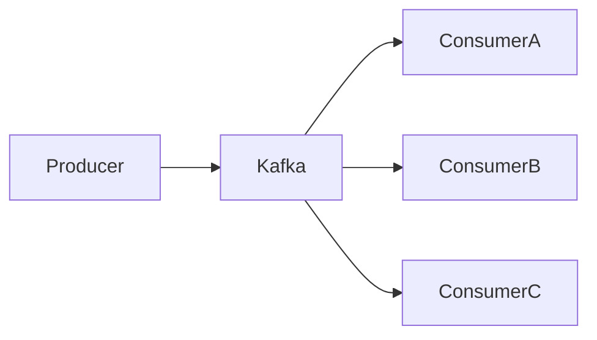

Standards:

- AsyncAPI
- CloudEvents

Patterns:

- Pub/Sub
- Event Sourcing
- Saga

---

# Part X. API Gateway Architecture

Responsibilities:

- Authentication
- Routing
- Authorization
- Rate Limiting
- Aggregation
- Caching

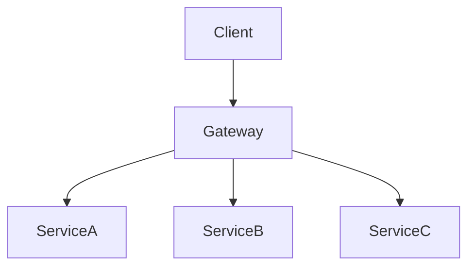

---

# Part XI. Backend For Frontend (BFF)

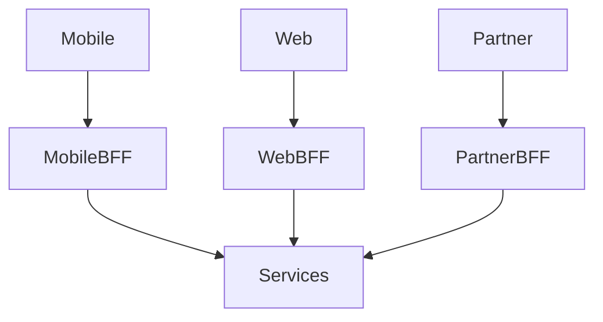

Benefits:

- Optimized payload
- Team autonomy

---

# Part XII. Service Mesh

## Istio Architecture

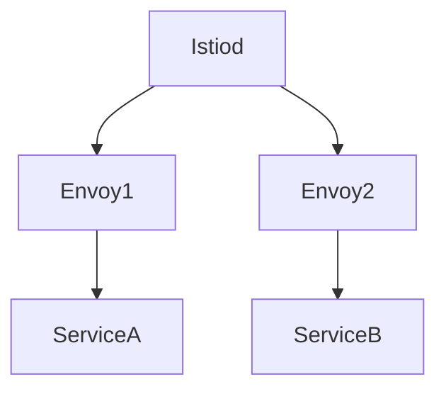

Capabilities:

- mTLS
- Canary Release
- Traffic Shaping
- Observability

---

# Part XIII. API Security

Layers:

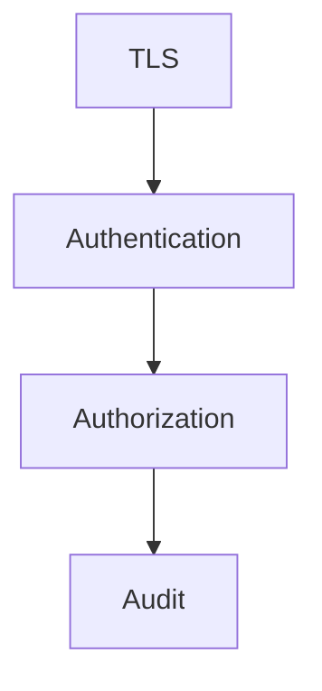

Topics:

- OAuth2
- OIDC
- JWT
- API Keys
- mTLS

---

# Part XIV. OAuth2 Deep Dive

Flows:

1. Authorization Code
2. Client Credentials
3. Refresh Token

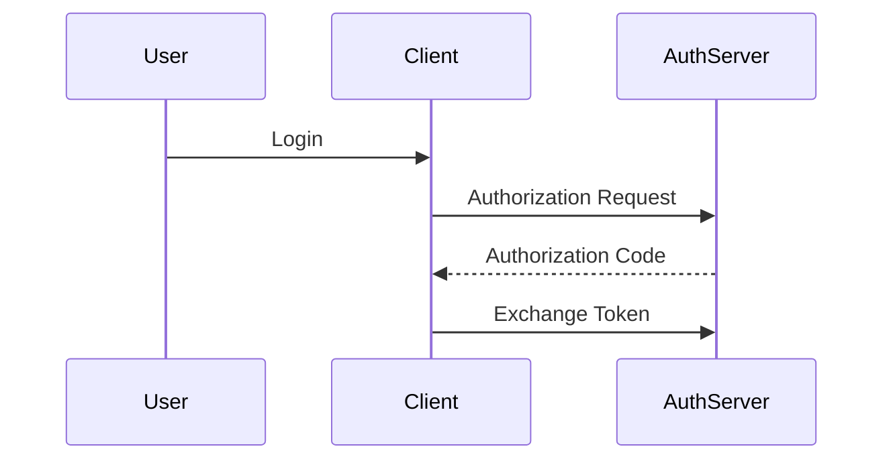

---

# Part XV. JWT Best Practices

Structure:

```text
Header.Payload.Signature
```

Avoid:

- Sensitive payloads
- Missing expiration
- Long-lived tokens

---

# Part XVI. Zero Trust Security

Principles:

- Never Trust
- Always Verify
- Least Privilege
- Continuous Validation

---

# Part XVII. Contract First Development

Standards:

- OpenAPI 3.x
- AsyncAPI
- Protobuf

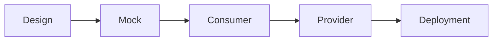

---

# Part XVIII. Consumer Driven Contracts

Tool:

- Pact

Benefits:

- Safe deployments
- Compatibility validation

---

# Part XIX. API Observability

Golden Signals:

- Latency
- Traffic
- Errors
- Saturation

Technology Stack:

- OpenTelemetry
- Prometheus
- Grafana
- Jaeger

---

# Part XX. API Governance

Governance Topics:

- Naming Standard
- Security Standard
- Version Standard
- Documentation Standard
- Lifecycle Management

Enterprise API Review Board:

- Design Review
- Security Review
- Compliance Review

---

# Part XXI. API Monetization

Business Models:

- Subscription
- Usage-Based
- Freemium
- Partner APIs

---

# Part XXII. Multi-Region APIs

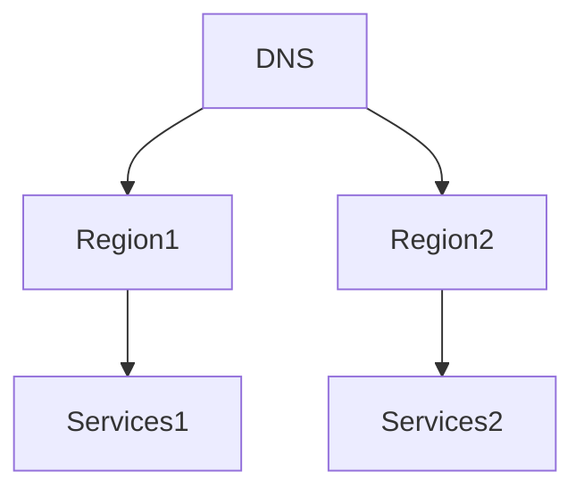

Topics:

- Geo Routing
- Active-Active
- Disaster Recovery

---

# Part XXIII. Real-World Architecture

## E-Commerce

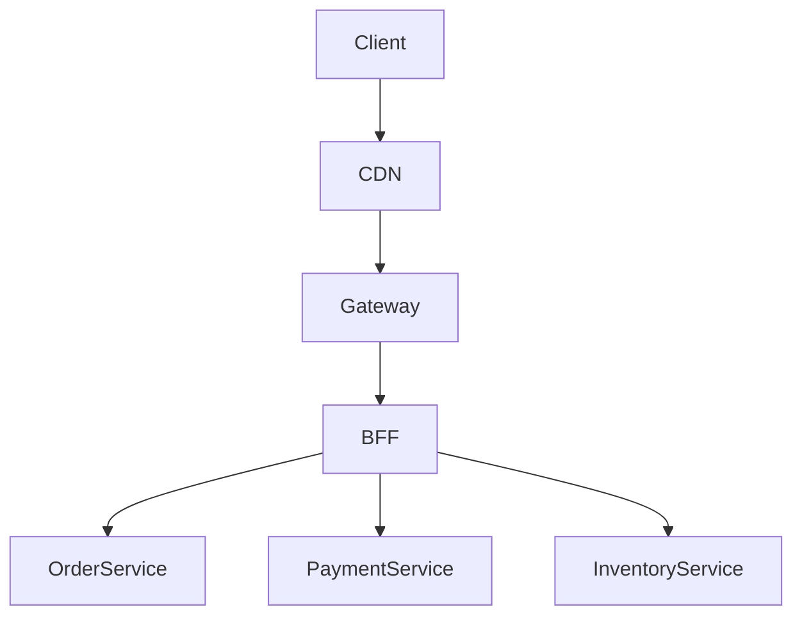

## Open Banking

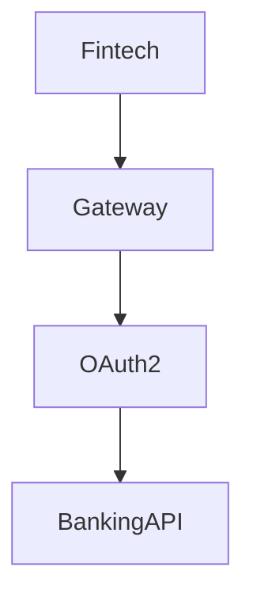

---

# Part XXIV. Anti-Patterns

❌ Chatty APIs
❌ Breaking Changes
❌ Shared Databases
❌ Missing Rate Limits
❌ No Observability
❌ API Gateway as ESB

---

# Part XXV. Architect Interview Questions

1. REST vs GraphQL vs gRPC?
2. API Gateway vs Service Mesh?
3. OAuth2 vs OIDC?
4. Contract-First vs Code-First?
5. BFF vs GraphQL?
6. AsyncAPI vs OpenAPI?
7. How would you govern 500+ APIs?
8. How would you design Open Banking APIs?
9. How would you secure service-to-service communication?
10. How would you build multi-region APIs?

---

# Principal Engineer Checklist

✅ REST
✅ GraphQL
✅ gRPC
✅ AsyncAPI
✅ API Gateway
✅ BFF
✅ Service Mesh
✅ OAuth2
✅ OIDC
✅ JWT
✅ mTLS
✅ Contract-First
✅ Consumer Driven Contract
✅ API Governance
✅ Multi-Region Architecture
✅ Enterprise Integration Architecture
